## Hey! 👋 I'm Rohan, meet my octocat!

## ABOUT ME
I am interesteding in distributed systems, cloud computing, machine learning, and full-stack software engineering. 
## I am currently working on
- Developing a raft algorithm simulator with rust and c++
- Learning system design best practicies
- grinding leetcode
## Cool Project To Check Out
- Federated Learning Platform: Utilizing distributed systems to enable privacy-preserving machine learning on decentralized data sources without ever moving raw data from edge devices

### Skills

###  GitHub Metrics

###  6-Month Isometric Commit Calendar

  
